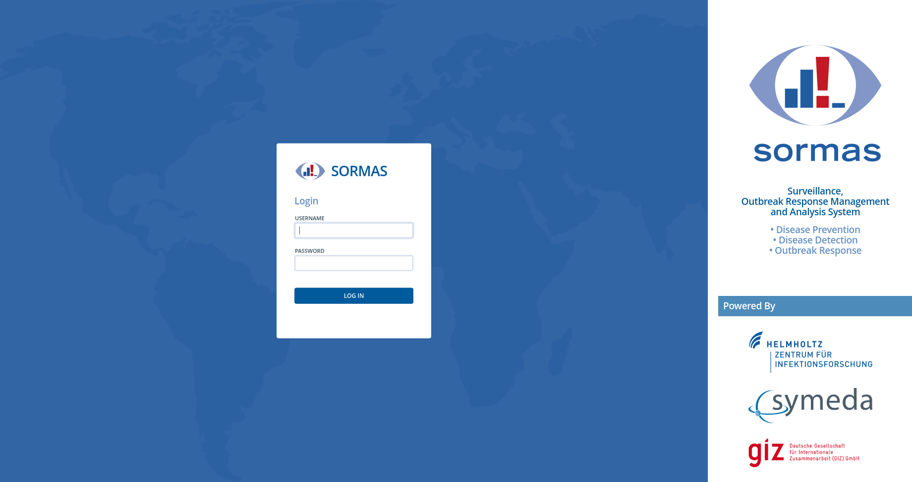

This repo provides a helm chart to deploy [Sormas](https://github.com/hzi-braunschweig/SORMAS-Project) into Kubernetes. It has two parts the [Sormas Helm Chart](/sormas-helm)   and [Postgres Helm Chart config](/sormas-postgres) which provides an example values file and a Dockerfile to extend [Bitnami Postgresql Docker Image](https://github.com/bitnami/bitnami-docker-postgresql) by adding temporal_tables extension. The postgresql helm chart uses the bitnami docker images and provides a lot of cool features including turnkey replication if you need it so using it is a no brainer. Head over to the link above for more details on how to use the chart. Just remember to use your custom postgresql image base on the Dockerfile in this repo os build your own.  This may eventually be turned into a composite helmchart with both postgresql chart and sormas chart deployed in a single go.
**Deploying Postgresql Chart**

```
git clone https://github.com/livinggoods/sormas-k8s
cd sormas-k8s/sormas-postgres
cp value.yaml to custom-values.yaml
```
Update

 - postgresqlPassword -> this will be the default postgres user password
 - SORMAS_POSTGRES_PASSWORD -> the password for sormas_user user
 - PGPASSWORD -> this is similar to postgresqlPassword and is used to initialise the Sormas db
 - persistence -> modify this accordingly
 - resources am requesting 4GB of ram you can go higher or lower
Now the fun bit
```
kubectl create ns sormas
helm upgrade --install  sormas-db bitnami/postgresql -f custom-values.yaml --namespace sormas
```
Note the incluster postgres url you will user that as dbHost when configuring the Sormas chart
**Install Sormas Chart**
``` 
cd ../
cp sormas-custom-values.yaml.example sormas-custom-values.yaml
```
Update the values with necessary values and run

```
helm upgrade --install  sormas-app sormas-helm  --namespace sormas -f custom-values.yaml
```
Finally profit 🥳🥳🥳🥳.
# The Sormas Operator
## About
The Operator build with the RedHat Operator Framework allows you to easily manage your SORMAS instances with a CRD.
## Deployment
For K8S use ```kubectl``` OpenShift ```oc```:
```bash
kubectl apply -f sormas-operator/deploy/service_account.yaml
kubectl apply -f sormas-operator/deploy/role.yaml
kubectl apply -f sormas-operator/deploy/role_binding.yaml
kubectl apply -f sormas-operator/deploy/crds/sormas.hzi-braunschweig.com_sormashelms_crd.yaml
kubectl apply -f sormas-operator/deploy/operator.yaml
```
Wait for the pod running correctly:
```bash
kubectl get pods -w
```
Run the test deployment:
```bash
kubectl apply -f kubectl apply -f sormas-operator/deploy/crd/sormas.hzi-braunschweig.com_v1alpha1_sormashelm_cr.yaml
```
Watch your pods being created:
```bash
kubectl get pods -w
```
Connect an ingress or route to the sormas-service and go to the URL...
Ready to fight diseases!

